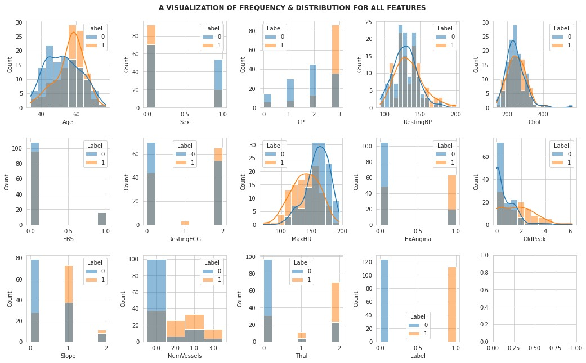
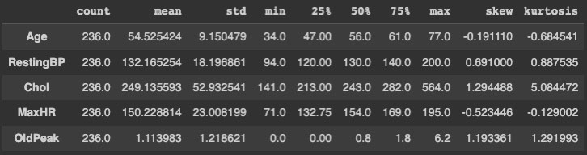
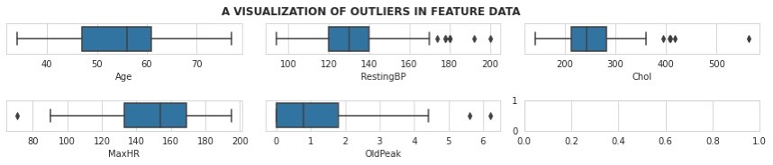
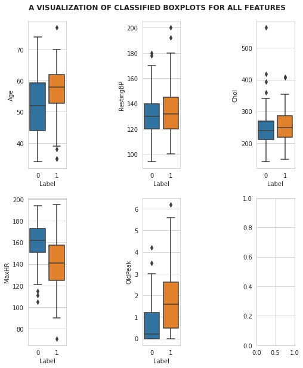
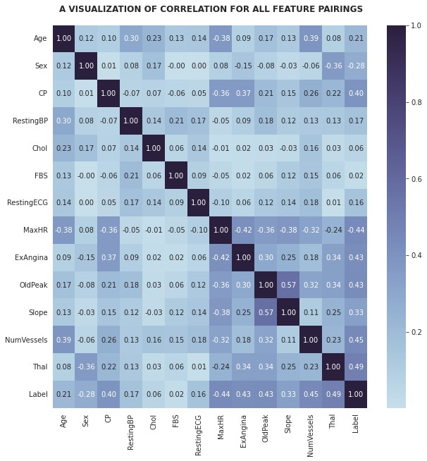
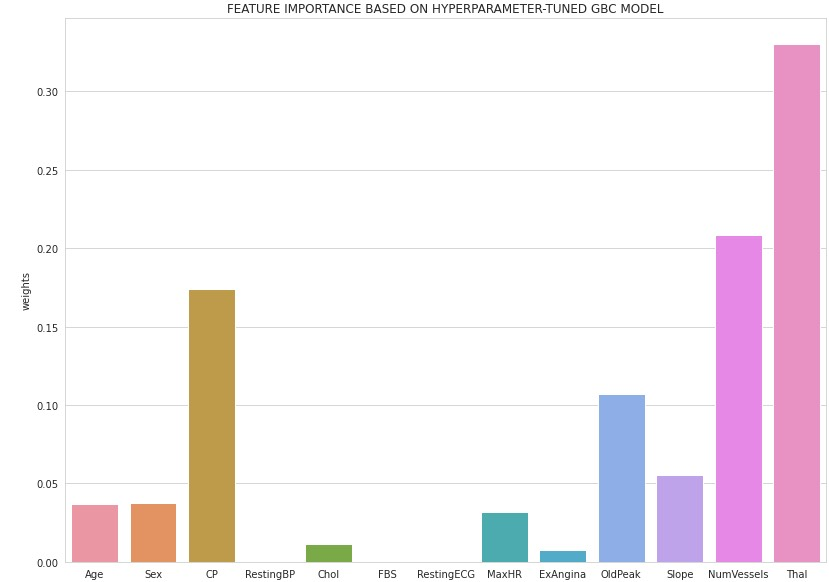

# CapstoneProjectFinal
Capstone Project for Deloitte AI Academy

# Increasing Efficiency of Heart Disease Diagnoses using ML Models

It is relatively common knowledge that cardiovascular disease is the leading cause of mortality worldwide, accounting for more than 17M deaths annually. Thus, it is clearly important to explore the significance of symptoms, health factors, and other indicators as they relate to heart disease. Trained algorithms would be able to help doctors identify patterns in large amounts of data, which can improve accuracy and timeliness of diagnoses. In addition, it would decrease pressure on medical professionals and have some positive effect on the cost, efficiency, and price of medical treatment. This project uses patient data such as heart rate, age, sex, and other cardiovascular indicators to train supervised classification models, the best of which predict heart disease diagnosis with ~87% accuracy.

I would like to note that the data for this project was sourced from the UCI Machine Learning Repository, linked [here](https://archive.ics.uci.edu/ml/index.php).

## Establishing an Understanding of the Problem
### Risk-Factors of Cardiovascular Disease
Making an effort to understand the problem is extremely helpful in creating accurate and efficient algorithms. When considering the data features, most were familiar, such as age, sex, resting blood pressure, cholesterol, resting ECG, maximum heart rate, etc. However, some features like exercised-induced angina (chest pain caused by reduced blood flow) [[1]](https://www.ahajournals.org/doi/10.1161/01.cir.0000060545.09308.f5) and thalassemia (inherited blood disorder causing subnormal hemoglobin levels) [[2]](https://www.ahajournals.org/doi/full/10.1161/CIRCHEARTFAILURE.109.913863) were unfamiliar. 

There is a significant amount of literature that discusses thalassemia being a high-risk indicator of heart disease. For example, a 1989 research study of 1087 thalassemia patients found that 64% of the death rate could be attributed to cardiovascular disease. [[3]](https://www.sciencedirect.com/science/article/pii/S014067368990264X) In addition, a risk assessment of cardiovascular disease conducted by Björn Dahlöf cited "hypertension" and "high levels of cholesterol" as important indicators of cardiovascular disease worldwide. [[4]](https://www.sciencedirect.com/science/article/pii/S0002914909024825) Based on this research, predicting that thalassemia, cholesterol, and resting blood pressure will have the highest effect on accurate diagnoses is a viable initial hypothesis. 

### Exploratory Data Analysis
The exploratory data analysis performed involved a substantial amount of visualization. The data was split into training and testing first to avoid biases during analysis. We first wished to determine the shape of the data for each feature as it related to the target to gather some intuition as to what features may potentially be important. In addition, any required data transformations would be apparent. I generated the following histograms, one for each feature...

Immediately, it can be seen that there were several quantitative features that were significantly skewed. This motivated an analysis of the statistical distribution of the data, which is shown below...
   

In particular, the skew and kurtosis of the quantitative features in the dataset were interesting. Notice that resting blood pressure, cholesterol, and old peak were all relatively skewed compared to the other features. To combat this, I designed a feature engineering algorithm that normalized the data using various statistical methods. This included handling outliers in different ways, which can be visualized in the figures below. The first set of 
Another way to handle the skew and kurtosis was to check for outliers in the data. To do this, I graphed several boxplots. For the first set of only the frequency was graphed. For the second set of boxplots, the data was separated among the target label and then graphed. 

Finally, an understanding of the relationships between features was essential. For that purpose, it was natural to produce a heatmap of the correlation matrix. The colors in the heatmap below correspond to the absolute value of the correlation coefficient between the two features, while the numbers in the boxes are the true correlation coefficient values. 

This visualization was especially surprising because there was only one distinct feature pairing that had a correlation coefficient greater than 0.5. For this reason, pairwise feature engineering was bypassed.

## Methodology & Results
The Gradient Boosting Classifier model from 
[Sci-Kit Learn](https://scikitlearn.org/stable/modules/generated/sklearn.ensemble.GradientBoostingClassifier.html) was chosen because of its parameter flexibility and predictive accuracy. There are several hyperparameters that the user is able to tune such that these parameters are assigned the most optimal settings. To train this model, the outliers were first removed. Initially, the GBC algorithm was executed with default parameters to establish a baseline. Next, to create the final model, a hyperparameterization technique was executed to increase the accuracy metrics of the model. 

To conduct this hyperparameterization, I used GridSearchCV, which (by default) uses 5-fold cross validation when training the model.
The parameters varied were max_depth, min_samples_split, and n_estimators. When the best estimator of these varying parameters was extracted, the maximum depth optimal value was 3, the minimum split samples optimal value was 6, and the number of estimators optimal value was 10.

On the test set, the baseline gradient boosting classifier had an accuracy of 0.80, an AUC of 0.913, an f1 score of 0.76, and a sparsity of 0. After the training algorithm and model was tested, the trained model had an accuracy of 0.87, an AUC of 0.93, an f1 score of 0.82, and a sparsity of 0.231. Clearly, the trained model outperformed the baseline GDC in every metric.

Note here that our models outperformed literature baselines by a significant amount, but this may be because of inconsistencies and unavailability of medical data for those particular datasets. For this reason, I chose to establish an internal baseline.

In addition to the scoring metrics, I also visualized the coefficient weights attributed to each feature in the final model. The following plot was produced...

We can see that the most significant cardiovascular-risk indicators were thalassemia, number of vessels colored by flouroscopy (NumVessels), and chest pain (CP), in decreasing order. The initial hypothesis was partially confirmed, with thalassemia being the most significantly weighted feature based on this classification model. 

## Conclusion
Based on the methods implemented in this data analysis project, a trained and hyperparameter-tuned gradient boosting classifier can achieve ~87% accuracy, which is 7 percentage points greater than the baseline values. This, of course, does rely on some in-house feature engineering and relatively organized and refined data. The feature coefficients of the trained model suggest that thalassemia, number of flouroscopy colored vessels, and degree of chest pain were the most significant indicators of heart disease diagnosis, in decreasing order. 

As for use of the models described in this project, it is not completely clear at the conclusion of this study that the model is generalizable to real-world, unrefined patient data. There may be other important factors that are more deterministic of a heart disease diagnosis and the model may not consider other important factors. For this reason, I advise against using this model with no supervision. However, it can be used to help doctors identify patterns in large sets of patient data and may help doctors prepare in advance for certain patient profiles to have heart disease. In short, this model should be treated as an extremely efficient assistant that still needs an expert to monitor the results it outputs.

## Repository Navigation

The repository has a relatively simple organization and contains the following components...
- /images (folder of images/visualizations used in README.md)
- .gitignore
- CapstoneFinalProject.ipynb
- README.md
- requirements.txt

It should not be difficult to reproduce the results of this study. For clarity and ease of reproduction, note that I used Google Colab as Python notebook editor on a Safari browser on MacOS. The only package requirement is sci-kit learn, which can be installed in Google Colab with the command "!pip install -U scikit-learn", which is included in the final notebook. Of course, a working version of Python3 is also required. The dataset used in this study is publicly available for use at the UCI Machine Learning Repository and is linked [here](https://archive.ics.uci.edu/ml/datasets/heart+disease).  

### Final Links
[Final Notebook](/CapstoneFinalProject.ipynb)
[Final Presentation](/_____)

